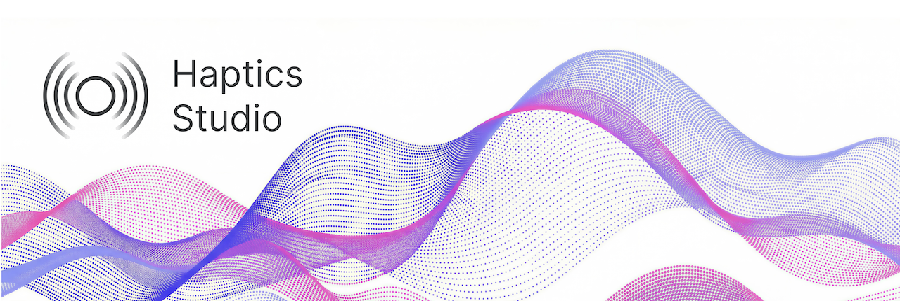

<picture>
  <source media="(prefers-color-scheme: dark)" srcset="./assets/logo-dark.png">
  <source media="(prefers-color-scheme: light)" srcset="./assets/logo-light.png">
  
</picture>

Design, audition, and export haptic experiences from audio — on macOS and Windows.

License: MIT | Platforms: macOS, Windows | Built with Electron

Haptics Studio is an open-source desktop application for designing advanced haptics. Automatically generate a haptic clip from an audio file, fine-tune it with a visual envelope editor, preview it in real time on Meta Quest or mobile devices, and export to every major haptic format — all from one tool.

Note: Haptics Studio is the open-source project. Meta Haptics Studio (<https://developers.meta.com/horizon/resources/haptics-studio/>) is a distribution of this project maintained and published by Meta, with additional Meta branding and documentation. This is similar to the relationship between Chromium and Google Chrome, or Code - OSS and Visual Studio Code. The source code in this repository is available to everyone under the MIT license.

## Features

  * Audio-to-Haptics Conversion — Generate haptic clips from .wav or .mp3 files (tunable digital signal processing).
  * Visual Envelope Editor — Edit amplitude and frequency envelopes with precision controls.
  * Real-Time Device Preview — Audition haptics instantly on Meta Quest headsets (via USB or Wi-Fi) and mobile devices through a companion app.
  * Multi-Format Export — Export to .haptic (universal JSON format), .ahap (Apple Core Haptics), Android haptic arrays, and .wav rendered audio.
  * Project Management — Organize clips into groups, add markers and notes, and save everything as a .hasp project file.
  * Sample Library & Tutorials — Built-in haptic packs and guided tutorials to get you started quickly.

## Getting Started

### Prerequisites

  * Node.js 24.x LTS (<https://nodejs.org/>)
  * Yarn (install globally: `npm install -g yarn`)
  * Rust: Install Rust by following the instructions on https://rustup.rs/.

**macOS setup (recommended):**

``` bash
brew install nvm
nvm install 24
nvm alias default 24
npm install -g yarn

```

**Windows setup:**

``` bash
choco install nodejs-lts
npm install -g yarn

```

### Quick Start

``` bash
# Clone the repository
git clone https://github.com/facebook/haptics-studio haptics-studio
cd haptics-studio

# Install dependencies (also builds native extensions)
yarn install

# Run in development mode
yarn start:dev

```

This starts both the Electron backend and the webpack dev server. The app will open automatically. The frontend is also accessible at http://localhost:8080 for browser-based development.

## Architecture Overview

Haptics Studio is a cross-platform Electron application with a TypeScript codebase, split into two processes that communicate over IPC:

```
┌──────────────────────────────────────────────────────────────┐
│                   Electron Main Process                      │
│                                                              │
│  main.ts → MainApplication (singleton)                       │
│    ├── IPC Listeners — clips, project, files, device, etc.   │
│    ├── Actions — audio analysis, file ops, project CRUD      │
│    ├── HapticsSdkNapi — Rust NAPI addon (DSP & rendering)    │
│    ├── Project — in-memory state, auto-save every 500 ms     │
│    ├── WSServer — Socket.IO (:9999) for device preview       │
│    ├── ADB Device Manager — USB discovery & port forwarding  │
│    └── FFmpeg — audio format conversion (WASM)               │
│                                                              │
├──────────────────────────── IPC ─────────────────────────────┤
│                                                              │
│                  Electron Renderer Process                   │
│                                                              │
│  React 17 + Redux Toolkit + Konva (canvas)                   │
│    ├── Home — project browser, sample library, tutorials     │
│    └── Editor                                                │
│          ├── Envelope Canvas — breakpoint editing (Konva)    │
│          ├── Left Panel — clip list, groups, drag & drop     │
│          ├── Right Panel — analysis params, design controls  │
│          └── Timeline — scrubber, zoom                       │
└──────────────────────────────────────────────────────────────┘

```

### Data Flow

This is how audio becomes a haptic experience:

```
Audio File (.wav/.mp3)
     │
     ▼
┌─────────────────┐
│  HapticsSdkNapi │    Rust NAPI addon — Offline Audio-to-Haptics DSP engine
│  Audio Analysis │    Decodes audio → runs offline analysis
└────────┬────────┘
         │
         ▼
┌─────────────────┐
│   HapticData    │    Amplitude + frequency envelopes
│   (in memory)   │    The core data model for all haptics
└────────┬────────┘
         │
   ┌─────┴──────┐
   ▼            ▼
┌────────┐  ┌──────────┐
│Envelope│  │ Project  │
│ Editor │  │  (.hasp) │    Auto-saved every 500ms
│(Konva) │  └─────┬────┘
└───┬────┘        │
    │    user     │
    │    edits    │
    ▼             ▼
┌─────────────────────┐
│       Export        │
│  .haptic  .ahap     │
│  .wav     Android   │
└─────────────────────┘

```

1.  Import — An audio file is loaded and decoded via the Haptics SDK.
2.  Analyze — The Offline Audio-to-Haptics DSP engine extracts amplitude and frequency envelopes, producing haptic data.
3.  Edit — The envelope editor renders the haptic data on a canvas. Users add, move, and delete breakpoints. Each edit triggers an IPC call that updates the in-memory project.
4.  Preview — Haptic data is rendered to device-specific formats and streamed over WebSocket to a companion app on Quest or mobile.
5.  Export — The final haptic data is exported in one or more formats (see Export Formats).

## Project Structure

```
Haptics-Studio/
├── main/                    # Electron main process (backend)
│   ├── src/
│   │   ├── main.ts          # ← Entry point
│   │   ├── application.ts   # App lifecycle, window, menu, ADB polling
│   │   ├── hapticsSdk.ts    # Rust NAPI bridge — DSP, rendering, validation
│   │   ├── wsServer.ts      # Socket.IO server for device preview
│   │   ├── device.ts        # ADB device discovery & USB forwarding
│   │   ├── updater.ts       # Auto-updater (electron-updater)
│   │   ├── ffmpeg.ts        # Audio conversion (FFmpeg WASM)
│   │   ├── listeners/       # IPC handlers (clips, project, files, device…)
│   │   ├── actions/         # Business logic (analysis, files, project)
│   │   ├── common/          # Shared utils, project model, configs, logger
│   │   └── menu/            # Native application menu
│   ├── actuators/           # Actuator profiles (.acf) for rendering
│   ├── renderers/           # Render settings per device/format
│   ├── samples/             # Built-in haptic sample packs & tutorials
│   ├── configs/             # Environment configs (dev, prod, test)
│   └── test/                # Backend unit tests
│
├── frontend/                # Electron renderer process (UI)
│   └── src/
│       ├── components/
│       │   ├── editor/
│       │   │   ├── envelope/    # Haptic envelope canvas
│       │   │   ├── leftpanel/   # Clip list, groups, navigator
│       │   │   ├── rightpanel/  # Analysis params, design controls
│       │   │   └── timeline/    # Timeline scrubber, zoom
│       │   ├── home/            # Landing page, project browser
│       │   ├── tutorial/        # In-app guided tutorials
│       │   └── common/          # Shared UI components
│       ├── state/               # Redux store
│       ├── hooks/               # Custom React hooks
│       └── styles/              # Shared Styles
│
├── shared/                  # Shared between main & renderer
│   ├── ipc-channels.ts      # Typed IPC channel definitions
│   ├── ipc-types.ts         # IPC payload type definitions
│   └── typed-ipc.ts         # Type-safe IPC wrappers
│
├── companion/               # Companion apps for device auditioning
│   ├── quest/               # Unity VR companion (Meta Quest)
│   ├── ios/                 # iOS mobile example
│   └── android/             # Android mobile example
│
├── native/                  # Native Node.js extensions (C++/Rust)
├── e2e/                     # End-to-end tests (Playwright)
├── scripts/                 # Build and utility scripts
└── package.json             # Scripts, dependencies, build config

```

## Building from Source

### Development

Run the Electron app with hot-reloading frontend:

``` bash
yarn start:dev

```

Or run the backend and frontend separately (recommended for development):

``` bash
# Terminal 1 — Frontend (with hot reload)
yarn frontend:start:dev

# Terminal 2 — Backend
yarn main:start:dev

```

Enable developer messages for debugging:

``` bash
DEVELOPER_MESSAGES=true yarn start:dev

```

### Production Build

``` bash
# Build everything for production
yarn build:prod

# Build and package for macOS
yarn buildAndPackage:mac

# Build and package for Windows
yarn buildAndPackage:win

```

Packaged artifacts appear in `./dist/`:

  * macOS: `.dmg` installer
  * Windows: `.exe` NSIS installer

### Native Extensions

The Rust NAPI addon (`HapticsSdkNapi`) is built automatically during `yarn install`. To rebuild it manually:

``` bash
yarn native:update

```

Binaries are placed in `./native/bin/`.

### Linting & Type Checking

``` bash
yarn frontend:lint        # ESLint — frontend
yarn main:lint            # ESLint — backend
yarn frontend:typecheck   # TypeScript — frontend
yarn main:typecheck       # TypeScript — backend

```

### Testing

``` bash
# Run all unit tests
yarn test:all

# Run end-to-end tests (requires a packaged build)
yarn test:e2e:prepare:mac   # or test:e2e:prepare:win
yarn test:e2e

```

## Export Formats

| Format          | Extension                 | Description                                                   | Method                                       |
| :-------------: | :-----------------------: | :-----------------------------------------------------------: | :------------------------------------------: |
| Haptic Clip     | `.haptic`                 | Cross-platform JSON — the canonical haptic interchange format | Direct serialization of `HapticData`         |
| Core Haptics    | `.ahap`                   | Apple Core Haptics format for iOS/macOS                       | `hapticDataToSplitAhap()` via native SDK     |
| Android         | `.json` / `.kt` / `.java` | Android-compatible amplitude + timing arrays                  | `getAmplitudeAndTimingArrays()`              |
| Rendered Audio  | `.wav`                    | Haptic signal rendered through an actuator profile            | `renderHapticDataToAudio()` + `.acf` profile |
| Project Package | `.zip`                    | Complete bundle: `.hasp` project + audio + all exports        | Archive utility                              |

### Actuator Profiles

Rendered .wav output is shaped by actuator characteristic files (`.acf`) in `main/actuators/`:

| Profile              | Device                    |
| :------------------: | :-----------------------: |
| `meta_quest_pro.acf` | Meta Quest Pro controller |

## Companion Apps (Auditioning)

Haptics Studio includes companion apps that let you preview ("audition") haptic clips on real hardware in real time. The desktop app acts as a server; companion apps on VR headsets or mobile devices connect as clients, receive haptic data, and play it on the device's native haptic engine.

This repository ships two companion apps:

| App                        | Platform   | Technology  | Purpose                                         |
| :------------------------: | :--------: | :---------: | :---------------------------------------------: |
| VR Companion App           | Meta Quest | Unity (C\#) | Full-featured auditioning on Quest controllers  |
| iOS Mobile Example App     | iOS        | Swift       | Reference implementation for mobile auditioning |
| Android Mobile Example App | Android    | Kotlin      | Reference implementation for mobile auditioning |

### How Desktop and Companion Apps Relate

```
┌──────────────────────┐           ┌──────────────────────┐
│   Haptics Studio     │           │   Companion App      │
│   (Desktop)          │           │   (Quest / Mobile)   │
│                      │           │                      │
│  ┌────────────────┐  │  Socket   │  ┌────────────────┐  │
│  │  WSServer      │◄═╪═══════════╪═►│  SocketClient  │  │
│  │  (Socket.IO)   │  │   .IO     │  │  (connects)    │  │
│  └───────┬────────┘  │           │  └───────┬────────┘  │
│          │           │           │          │           │
│  ┌───────┴────────┐  │           │  ┌───────┴────────┐  │
│  │  Project Model │  │           │  │  Haptics SDK   │  │
│  │  (clips, audio)│  │           │  │  (playback)    │  │
│  └────────────────┘  │           │  └────────────────┘  │
│                      │           │                      │
│  ┌────────────────┐  │           │  ┌────────────────┐  │
│  │ HapticsSdkNapi │  │           │  │ Native Haptic  │  │
│  │ (DSP, render)  │  │           │  │ Engine         │  │
│  └────────────────┘  │           │  └────────────────┘  │
└──────────────────────┘           └──────────────────────┘

```

The desktop app is the source of truth — it holds the project, runs audio analysis, and generates all haptic formats. Companion apps are thin clients that request data, receive it over the wire, and play it using the platform's native haptic APIs.

### Communication Protocol

The desktop and companion apps communicate over a three-layer protocol:

#### 1\. Discovery (UDP Broadcast)

The desktop app continuously broadcasts its presence on the local network:

```
Desktop ──── UDP broadcast ────► port 9998
             {"hostname": "MyMac.local", "port": 9999}

```

Companion apps listen on port 9998, parse the broadcast to learn the desktop's IP address and WebSocket port, and present it in a connection list.

#### 2\. Connection (Socket.IO)

Once a host is selected, the companion app opens a Socket.IO connection:

```
Companion ──── Socket.IO connect ────► desktop:9999
               query: { deviceId, name, model, version }

```

The connection uses Socket.IO (Engine.IO v4) over HTTP with a 5-second ping interval.

USB alternative: For Android devices (e.g. Meta Quest) connected via USB, the ADB Device Manager on the desktop sets up port forwarding (`adb reverse`), allowing the companion app to connect to `localhost:9999` without network discovery.

#### 3\. Authentication (Pairing Code)

New devices must pair using a numeric code:

```
Desktop                              Companion
   │                                    │
   │──── "auth_required" ──────────────►│
   │     (display pairing code in UI)   │  User enters code
   │                                    │  shown on desktop
   │◄─── "auth_request" ────────────────│
   │     { authCode: "1234" }           │
   │                                    │
   │  [validate code]                   │
   │                                    │
   │──── "auth_request" ───────────────►│
   │     { status: "ok" }               │
   │                                    │
   │  Device saved to known list        │
   │  (auto-connects next time)         │

```

Previously paired devices skip this step and receive an `"auth_granted"` event immediately on connection.

### Data Over the Wire

Once connected and authenticated, the desktop pushes project and clip data to the companion app. All data is transmitted as JSON over Socket.IO events:

| Event               | Direction        | Payload                                                                              | Purpose                           |
| :-----------------: | :--------------: | :----------------------------------------------------------------------------------: | :-------------------------------: |
| `current_project`   | desktop → device | Clip list (names, IDs, MIME types), groups, current selection                        | Sync project state                |
| `clip_update`       | desktop → device | Full clip: HapticData JSON, waveform SVG, markers, settings                          | Push edits in real time           |
| `get_clip`          | device ↔ desktop | Request by clip ID → full clip data response                                         | On-demand clip fetch              |
| `get_audio`         | device ↔ desktop | Request by clip ID → audio as base64 data URI or binary buffer                       | Audio for synchronized playback   |
| `get_ahap`          | device ↔ desktop | Request by clip ID → AHAP JSON (Apple Core Haptics format)                           | iOS haptic playback               |
| `get_android`       | device ↔ desktop | Request by clip ID (+ optional gain, sampleRate) → amplitude\[\] + timing\[\] arrays | Android haptic playback           |
| `current_clip`      | desktop → device | `{ currentClipId }`                                                                  | Notify clip selection change      |
| `set_current_clip`  | device → desktop | `{ clipId }`                                                                         | Change selection from device      |
| `project_close`     | desktop → device | (empty)                                                                              | Notify project was closed         |
| `play_test_pattern` | desktop → device | (empty)                                                                              | Trigger a test buzz on the device |

Key data formats on the wire:

  * HapticData — The canonical haptic format: JSON with amplitude and frequency envelope arrays (`{time, amplitude, emphasis?}` and `{time, frequency}` breakpoints). Passed through `sanitizedEnvelopes()` before transmission.
  * AHAP — Apple Haptic and Audio Pattern format, generated server-side by `hapticDataToSplitAhap()`.
  * Android arrays — Parallel `amplitudes[]` (0-255) and `timings[]` (ms) arrays, generated by `getAmplitudeAndTimingArrays()`.
  * Audio — Complete audio file as a base64 data URI (`data:mime;base64,...`) or raw binary buffer. Not streamed — transferred as a whole file on demand.

### VR Companion App (Unity)

The VR companion app is a Unity project:

```
companion/quest/
└── Assets/Scripts/
    ├── NetworkHandler.cs    # UDP discovery + Socket.IO connection management
    ├── SocketClient.cs      # Socket.IO client wrapper (SocketIOUnity library)
    ├── Connection.cs        # Connection UI (host list, manual IP, pairing code entry)
    ├── HapticStudio.cs      # Data models (Clip, AudioData, ClipGroup, Project)
    ├── ClipPlayer.cs        # Haptic playback via Haptics SDK
    └── ...

```

| Module           | Responsibility                                                                                                        |
| :--------------: | :-------------------------------------------------------------------------------------------------------------------: |
| `NetworkHandler` | Listens for UDP broadcasts on port 9998, manages Socket.IO connections, handles auth flow, dispatches incoming events |
| `SocketClient`   | Wraps the SocketIOUnity library with typed event handling and automatic reconnection                                  |
| `Connection`     | UI panel for selecting discovered hosts, entering manual IP/port, and submitting pairing codes                        |
| `HapticStudio`   | C\# data model classes that mirror the desktop's TypeScript models: Clip, AudioData, ClipGroup, Project               |
| `ClipPlayer`     | Receives clip data from NetworkHandler, passes it to the Haptics SDK for playback on Quest controllers                |

### Mobile Example App

The mobile companion app is a reference implementation for iOS (`companion/ios/`) and Android (`companion/android/`). It demonstrates how to:

  * Discover a Haptics Studio instance on the local network
  * Connect and authenticate via Socket.IO
  * Request and receive haptic clips
  * Play haptics using the platform's native API (Core Haptics or Android's Vibrator API)

This is intended as a starting point for developers building their own auditioning tools or integrating Haptics Studio preview into custom workflows.

## Relationship to Haptics SDK

Haptics Studio works alongside the Meta Haptics SDK (<https://github.com/facebook/meta-haptics-sdk>), which is a separate open-source project:

|               | Haptics Studio                                       | Haptics SDK                                    |
| :-----------: | :--------------------------------------------------: | :--------------------------------------------: |
| Purpose       | Design haptic clips                                  | Play haptic clips in your app                  |
| Role          | Authoring tool (desktop app)                         | Runtime library (Unity / Unreal / Native)      |
| Formats       | Imports audio, exports .haptic, .ahap, Android, .wav | Loads .haptic files and renders them on device |
| Where it runs | macOS / Windows desktop                              | Quest                                          |

How they connect:

1.  Design a haptic clip in Haptics Studio.
2.  Export it as a .haptic file (the cross-platform interchange format).
3.  Integrate the .haptic file into your app using the Haptics SDK.
4.  Play the clip at runtime — the SDK handles platform-specific rendering.

The native DSP engine that powers Haptics Studio's audio analysis and rendering is built from the same Haptics SDK core library (`HapticsSdkNapi` is a Rust NAPI binding to the SDK).

## Contributing

We welcome contributions\! Here's where to look depending on what you'd like to do:

### Add a New UI Feature

The frontend lives in `frontend/src/`. Start with the relevant component directory:

| Area                       | Directory                       | Key files                                                  |
| :------------------------: | :-----------------------------: | :--------------------------------------------------------: |
| Envelope editor            | `components/editor/envelope/`   | `HapticEnvelope.tsx`, `AudioEnvelope.tsx`, `PlotArea.tsx`  |
| Clip list / navigator      | `components/editor/leftpanel/`  | `LeftPanel.tsx`, `Navigator.tsx`, `NavigatorClip.tsx`      |
| Analysis & design controls | `components/editor/rightpanel/` | `RightPanel.tsx`, `AudioAnalyzer.tsx`, `DetailEditing.tsx` |
| Timeline                   | `components/editor/timeline/`   | `Timeline.tsx`, `TimelinePlot.tsx`                         |
| Home screen                | `components/home/`              | `Landing.tsx`                                              |
| Redux state                | `state/`                        | `store.ts`, `reducers.ts`, `selectors.ts`, `actions.ts`    |
| Custom hooks               | `hooks/`                        | 22 hooks for editor interactions, audio playback, etc.     |

### Add a New Export Format

1.  Define the format in `shared/ipc-types.ts` — add to the `ExportFormat` union type.
2.  Implement the export logic in `main/src/common/utils/export.ts`.
3.  Wire up the IPC handler in `main/src/listeners/clips/clipExport.ts`.
4.  Add UI controls in `frontend/src/components/common/ExportDialog.tsx`.

### Support a New Platform for Playback

Runtime playback on new platforms is best handled in the Haptics SDK repository (<https://github.com/facebook/meta-haptics-sdk>), not in Haptics Studio. The SDK is responsible for loading `.haptic` files and rendering them through each platform's native haptic API.

If you need to add a new rendering target for preview within Studio (e.g., a new actuator profile), add an `.acf` file to `main/actuators/` and a render settings entry in `main/renderers/`.

### Add a New Companion App

The companion app protocol is documented above in the Companion Apps section. To build a new companion app for a different platform:

1.  Implement UDP broadcast listening on port 9998 to discover desktop instances.
2.  Connect via Socket.IO to the discovered host on port 9999 with query params: `deviceId`, `name`, `model`, `version`.
3.  Handle the pairing flow (`auth_required` → `auth_request` → `auth_granted`).
4.  Listen for `clip_update` and `current_project` events to receive haptic data.
5.  Request specific formats via `get_ahap`, `get_android`, or `get_clip` depending on your platform.
6.  Use the Haptics SDK (or platform-native APIs) to play the received haptic data.

The VR companion app (`companion/quest/`) and mobile example (`companion/mobile/`) are good references.

## Application Data

The app stores configuration and logs in the following locations:

| Platform    | Path                                            |
| :---------: | :---------------------------------------------: |
| macOS       | `~/Library/Application Support/Haptics Studio/` |
| Windows     | `%APPDATA%/Haptics Studio/`                     |
| Development | Same path with `-dev` suffix                    |

## Core Data Models

### Project File (.hasp)

A `.hasp` file is a JSON document containing all clips, groups, and project metadata:

```
ProjectContent
  ├── version          — Semantic version (major.minor.patch)
  ├── metadata         — Name, description, slug, category
  ├── state            — Active clip ID, session ID
  ├── clips[]          — Array of haptic clips (see below)
  └── groups[]         — Clip grouping / folder hierarchy

```

### Haptic Clip

Each clip contains audio analysis settings, the resulting haptic data, and editor state:

```
Clip
  ├── name, notes, markers
  ├── audioAsset       — Source audio file reference
  ├── waveform         — Audio waveform visualization data
  ├── settings         — DSP analysis parameters (OATH)
  └── haptic           — HapticData (the core output)
        ├── signals.continuous.envelopes.amplitude[]  →  {time, amplitude, emphasis?}
        ├── signals.continuous.envelopes.frequency[]  →  {time, frequency}
        └── metadata (editor info, source, tags, description)

```

## License

This project is licensed under the MIT License — see the LICENSE file for details.
